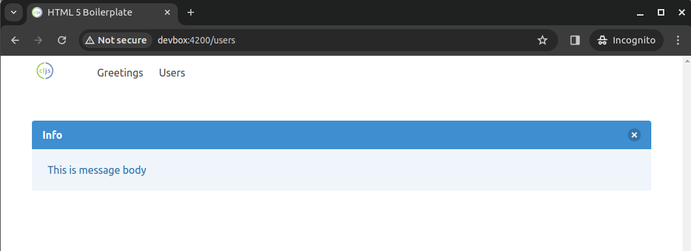

## ClojureScript browser app template

ClojureScript minimal application with
  - ClojureScript compilation using [shadow-cljs](https://github.com/thheller/shadow-cljs)
  - routing using [reitit](https://github.com/metosin/reitit)
  - app structure using [re-frame](https://github.com/day8/re-frame)
  - styling (flexbox) using [Bulma CSS](https://github.com/jgthms/bulma)

## Usage

1. `yarn install`
2. `npx shadow-cljs watch app`
3. Open http://localhost:4200

